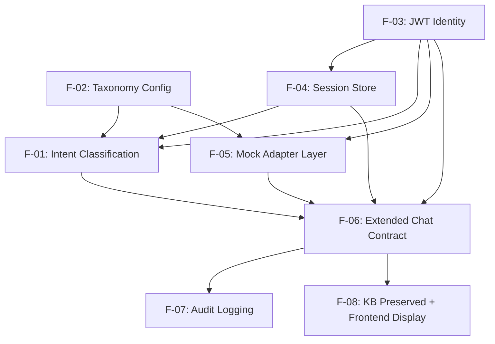

# Features

## Polygon Bot — Banking Intent & Service Routing

| | |
|---|---|
| **Document title** | Polygon Bot — Features |
| **Version** | 0.1 |
| **Date** | 2026-08-31 |
| **Based on** | SRS v0.1 |
| **Status** | Approved |

---

## F-01: Intent Classification & Routing Decision

- **Description:** Classifies each incoming `/chat` message — via one Ollama `/api/chat`
  tool-calling request against `qwen3:8b` — as a knowledge-base question, a banking-service
  request (with a category/service/subservice guess), or genuinely ambiguous (triggering a
  clarifying question). Uses recent session turns as context.
- **User value:** The single decision point that lets one chat endpoint serve both existing KB
  questions and new banking-service requests without the caller having to say which kind of
  question it is.
- **Requirements:** FR-ROUTE-01, FR-ROUTE-02, FR-ROUTE-03, FR-ROUTE-04, FR-ROUTE-05, NFR-PERF-01
- **Dependencies:** F-02 (taxonomy constrains the tool schema), F-03 (identity feeds banking-branch handling), F-04 (recent-turn context)
- **Complexity:** L
- **Priority:** Must
- **Risk:** Depends on `qwen3:8b` reliably supporting tool/function calling via `/api/chat` — unconfirmed until a technical spike (SRS §2.6 assumption). If it doesn't classify reliably, this feature's mechanism needs revisiting before the rest can be built on top of it.
- **Open questions:** none beyond the SRS's flagged assumption above.
- **Proposed owning area:** conversation-routing

## F-02: Banking Service Taxonomy Config

- **Description:** Loads and validates the category → service → subservice tree from
  `banking_services.yaml` at startup, including which adapter and identity requirement each
  subservice maps to. Fails startup loudly if the file is missing or invalid.
- **User value:** Lets the category/service/subservice structure be edited (added, removed,
  renamed) without touching any routing or classification code — the explicit requirement given
  since the official taxonomy will replace this provisional one later.
- **Requirements:** FR-CATALOG-01, FR-CATALOG-02, FR-CATALOG-03, FR-CATALOG-04, FR-CATALOG-05, NFR-MAINT-01
- **Dependencies:** none — foundational, other features depend on this.
- **Complexity:** S
- **Priority:** Must
- **Risk:** Low — a config-loading concern with a well-defined shape.
- **Open questions:** none.
- **Proposed owning area:** banking-service-catalog

## F-03: Customer Identity via JWT

- **Description:** Extracts and verifies a JWT from `Authorization: Bearer`, behind a pluggable
  verification function (real issuer/algorithm/key pending). Establishes the verified subject
  claim as the sole source of customer identity for banking-service requests; returns
  `AUTH_REQUIRED` when missing/invalid, and never blocks KB questions.
- **User value:** Ties banking-service requests to a real, verified customer — the thing that
  makes it safe to ever call a real banking API from this system later.
- **Requirements:** FR-IDENT-01, FR-IDENT-02, FR-IDENT-03, FR-IDENT-04, NFR-SEC-01
- **Dependencies:** none directly — foundational for the banking-service path.
- **Complexity:** M
- **Priority:** Must
- **Risk:** Real signing details aren't available yet (BRD Open Item 1) — this ships against a
  stub/placeholder verifier until the bank's auth team provides them; the interface is fixed now
  so swapping in the real implementation later shouldn't touch call sites.
- **Open questions:** none blocking — tracked as an SRS/BRD open item, not a feature-level unknown.
- **Proposed owning area:** customer-identity-session

## F-04: Session Context Store

- **Description:** In-memory, per-customer (keyed by JWT subject claim) store of recent chat
  turns with a 30-minute rolling idle expiry, capped in size, sitting behind a small
  get/set/expire interface so it can be swapped for a durable/shared store later.
- **User value:** Makes natural follow-ups ("what about yesterday") work without the caller
  having to resend prior context.
- **Requirements:** FR-IDENT-05, FR-IDENT-06, FR-IDENT-07
- **Dependencies:** F-03 (session is keyed by verified identity)
- **Complexity:** S
- **Priority:** Must
- **Risk:** Low — explicitly scoped to in-memory only for this phase (BRD Open Item 4 covers the
  future durable-store question, not a risk to building this now).
- **Open questions:** none.
- **Proposed owning area:** customer-identity-session

## F-05: Banking Service Adapter Layer (Mock)

- **Description:** A common `fulfill(customer_identity, subservice, payload) -> result` interface
  with mock adapter implementations per subservice, returning clearly-fake realistic data;
  surfaces `SERVICE_UNAVAILABLE` on adapter failure without leaking internal error detail.
- **User value:** Lets the main Polygon Bank team test the full round-trip flow today, and gives
  a clean seam to drop in real banking APIs later without touching routing/classification.
- **Requirements:** FR-INTEG-01, FR-INTEG-02, FR-INTEG-03, FR-INTEG-04, NFR-REL-01
- **Dependencies:** F-02 (taxonomy declares the adapter mapping), F-03 (identity passed to the adapter)
- **Complexity:** M
- **Priority:** Must
- **Risk:** Low technically (mocks); main risk is designing the interface generically enough that
  real adapters (with genuinely different per-service parameters) fit without a redesign.
- **Open questions:** none.
- **Proposed owning area:** banking-service-integration

## F-06: Extended Chat API Contract

- **Description:** Extends the `/chat` request with optional `category`/`service`/`subservice`/
  `payload`, and extends the SSE response with a new `result` event (carrying type, routing
  info, and a version marker) emitted after `token` events and before `done` — while leaving
  `token`/`done`/`error` and text-only requests behaving exactly as today.
- **User value:** This is the actual integration surface the main Polygon Bank application
  builds against — the point where classification, identity, and adapter results become one
  coherent API response.
- **Requirements:** FR-CONTRACT-01, FR-CONTRACT-02, FR-CONTRACT-03, FR-CONTRACT-04, FR-CONTRACT-05, FR-CONTRACT-06
- **Dependencies:** F-01, F-02, F-03, F-05
- **Complexity:** M
- **Priority:** Must
- **Risk:** Backward-compatibility regression risk for the existing external integration team —
  needs explicit regression testing against today's documented contract (`INTEGRATION.md`), not
  just new-behavior testing.
- **Open questions:** none.
- **Proposed owning area:** chat-api-contract

## F-07: Banking Request Audit Logging

- **Description:** Emits one structured log line per banking-service turn (request ID, session
  key, category/service/subservice, adapter invoked, outcome, latency), while ensuring no raw
  JWT, API key, or full sensitive adapter payload ever reaches a log line.
- **User value:** Gives the Polygon Bot owner (and, eventually, the bank's compliance/ops side) an
  audit trail for every banking-service interaction, without exposing sensitive data in logs.
- **Requirements:** FR-SEC-01, FR-SEC-02, FR-SEC-03, FR-SEC-04, NFR-SEC-02, NFR-OBS-01
- **Dependencies:** F-06 (logs emit as part of the chat flow), F-03, F-05 (identity ref + adapter outcome)
- **Complexity:** S
- **Priority:** Must
- **Risk:** Low — a logging concern with a well-defined field list.
- **Open questions:** exact log destination/format (BRD/SRS open item — assumed stdout structured JSON, not yet explicitly decided).
- **Proposed owning area:** security-compliance

## F-08: Preserve Existing KB Chat + Demo Frontend Display

- **Description:** Confirms zero functional change to the existing RAG pipeline (chunking,
  embeddings, vector store, document endpoints) and existing KB chat behavior; adds display of
  type/category/service/subservice/payload/routing to the demo frontend for testing the new
  behavior.
- **User value:** Guarantees the existing integration team sees no regression, and gives the
  Polygon Bot owner a way to visually verify classification/routing behavior while testing.
- **Requirements:** FR-KB-01, FR-KB-02
- **Dependencies:** F-06 (frontend displays the new `result` event's contents)
- **Complexity:** S
- **Priority:** Must
- **Risk:** Low, but requires deliberate regression testing (not just new-feature testing) given
  how explicitly the BRD/SRS emphasize "must not break."
- **Open questions:** none.
- **Proposed owning area:** kb-chat-preserved

## Dependency graph

## MVP cut

### Phase 1 (MVP)

All 8 features — F-01 through F-08. Every feature carries at least one Must-priority
requirement from the SRS; per the confirmed decision, this ships as one unstaged MVP rather than
split into phases. Build order follows the dependency graph above: F-02 and F-03 first
(foundational, no dependencies), then F-04 and F-05, then F-01, then F-06, then F-07 and F-08 in
parallel.

### Later phases

None — everything above is Phase 1.

## Orphan check

- FRs with no feature: none (all 25 BRD-inherited + 7 SRS-added requirements map to a feature above).
- Features with no FR/NFR: none.

## Assumptions & Constraints

- Carried forward from the BRD/SRS: provisional taxonomy, mock banking adapters, pluggable JWT
  verification pending real details, in-memory-only session store for this phase.
- Build order in Phase 1 follows the dependency graph; F-01's technical risk (tool-calling
  reliability) should be spiked early since several other features assume it works.

## Open Items (TBD)

1. Exact audit log destination/format — carried from SRS Appendix B, doesn't block building F-07. (§F-07)

---
*End of document — v0.1, Approved 2026-08-31. Open items: 1, non-blocking.*
